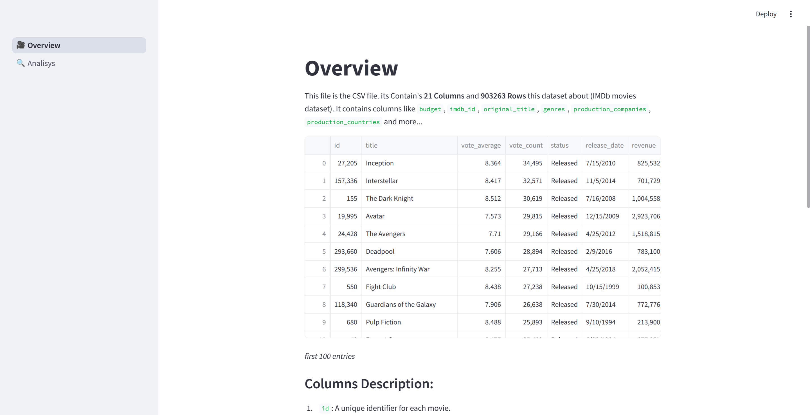

# imdb-movies

## A Streamlit dashboard based on imdb-movies dataset from Kaggle

### Key features:
- filter original data by `vote_average`, `genre`, `original_language`, `year` and `budget`
- automatic rerun on filter change
- `vote_average` distribution
- `budget` vs `revenue`
- `runtime` vs `budget`
- `original_language` distribution
- `month` vs `revenue`
- `budget` vs `popularity`
- code samples
- author's conclusions

### Dataset overview

Dataset: [Link](https://www.kaggle.com/datasets/anandshaw2001/imdb-data)

This file is the CSV file. its Contain's **21 Columns** and **903263 Rows** this dataset
about (IMDb movies dataset). It contains columns like `budget`, `imdb_id`, `original_title`,
`genres`, `production_companies`, `production_countries` and more...

1. `id`: A unique identifier for each movie.
2. `title`: The name of the movie.
3. `vote_average`: The average rating the movie has received from users (on a scale, typically from 0 to 10).
4. `vote_count`: The total number of votes or ratings submitted for the movie.
5. `status`: The current state of the movie (e.g., "Released," "Post-Production").
6. `release_date`: The date when the movie was officially released.
7. `revenue`: The total earnings the movie made (usually in USD).
8. `runtime`: The duration of the movie in minutes.
9. `adult`: Indicates whether the movie is classified as adult content (e.g., "True" or "False").
10. `budget`: The total cost of producing the movie (usually in USD).
11. `imdb_id`: The unique identifier for the movie on IMDb (Internet Movie Database).
12. `original_language`: The language in which the movie was originally produced (e.g., "en" for English).
13. `original_title`: The original title of the movie in its native language.
14. `overview`: A brief summary or description of the movie's plot.
15. `popularity`: A metric indicating how popular the movie is (typically based on views, searches, or ratings).
16. `tagline`: A short phrase or slogan associated with the movie.
17. `genres`: The categories or genres the movie belongs to (e.g., Action, Comedy, Drama).
18. `production_companies`: The names of the companies involved in producing the movie.
19. `production_countries`: The countries where the movie was produced.
20. `spoken_languages`: The languages spoken in the movie.
21. `keywords`: Important terms or phrases associated with the movie, often used for categorization or search.

### Screenshots

*fig. 1. Overview Page*

*fig. 2. Analisys Page*